### c302 activity summary 
<table>
<tr><td>&nbsp;</td><td align="center"><b><a href="https://github.com/openworm/CElegansNeuroML/blob/master/CElegans/pythonScripts/c302/c302_IClamp.py">IClamp</a></b></td><td align="center"><b><a href="https://github.com/openworm/CElegansNeuroML/blob/master/CElegans/pythonScripts/c302/c302_Syns.py">Syns</a></b></td><td align="center"><b><a href="https://github.com/openworm/CElegansNeuroML/blob/master/CElegans/pythonScripts/c302/c302_Pharyngeal.py">Pharyngeal</a></b></td><td align="center"><b><a href="https://github.com/openworm/CElegansNeuroML/blob/master/CElegans/pythonScripts/c302/c302_Social.py">Social</a></b></td><td align="center"><b><a href="https://github.com/openworm/CElegansNeuroML/blob/master/CElegans/pythonScripts/c302/c302_Oscillator.py">Oscillator</a></b></td><td align="center"><b><a href="https://github.com/openworm/CElegansNeuroML/blob/master/CElegans/pythonScripts/c302/c302_Muscles.py">Muscles</a></b></td><td align="center"><b><a href="https://github.com/openworm/CElegansNeuroML/blob/master/CElegans/pythonScripts/c302/c302_Full.py">Full</a></b></td></tr>
<tr><td><b><a href="https://github.com/openworm/CElegansNeuroML/blob/master/CElegans/pythonScripts/c302/parameters_A.py">Params A</a></b></td><td> <a href="https://github.com/openworm/CElegansNeuroML/blob/master/CElegans/pythonScripts/c302/examples/c302_A_IClamp.nml"/>NML</a>&nbsp;<a href="http://opensourcebrain.org/projects/celegans?explorer=https://raw.githubusercontent.com/openworm/CElegansNeuroML/master/CElegans/pythonScripts/c302/examples/c302_A_IClamp.nml"/>OSB</a></td><td> <a href="https://github.com/openworm/CElegansNeuroML/blob/master/CElegans/pythonScripts/c302/examples/c302_A_Syns.nml"/>NML</a>&nbsp;<a href="http://opensourcebrain.org/projects/celegans?explorer=https://raw.githubusercontent.com/openworm/CElegansNeuroML/master/CElegans/pythonScripts/c302/examples/c302_A_Syns.nml"/>OSB</a></td><td> <a href="https://github.com/openworm/CElegansNeuroML/blob/master/CElegans/pythonScripts/c302/examples/c302_A_Pharyngeal.nml"/>NML</a>&nbsp;<a href="http://opensourcebrain.org/projects/celegans?explorer=https://raw.githubusercontent.com/openworm/CElegansNeuroML/master/CElegans/pythonScripts/c302/examples/c302_A_Pharyngeal.nml"/>OSB</a></td><td> <a href="https://github.com/openworm/CElegansNeuroML/blob/master/CElegans/pythonScripts/c302/examples/c302_A_Social.nml"/>NML</a>&nbsp;<a href="http://opensourcebrain.org/projects/celegans?explorer=https://raw.githubusercontent.com/openworm/CElegansNeuroML/master/CElegans/pythonScripts/c302/examples/c302_A_Social.nml"/>OSB</a></td><td> <a href="https://github.com/openworm/CElegansNeuroML/blob/master/CElegans/pythonScripts/c302/examples/c302_A_Oscillator.nml"/>NML</a>&nbsp;<a href="http://opensourcebrain.org/projects/celegans?explorer=https://raw.githubusercontent.com/openworm/CElegansNeuroML/master/CElegans/pythonScripts/c302/examples/c302_A_Oscillator.nml"/>OSB</a></td><td><a href="summary_A_Muscles.md"/>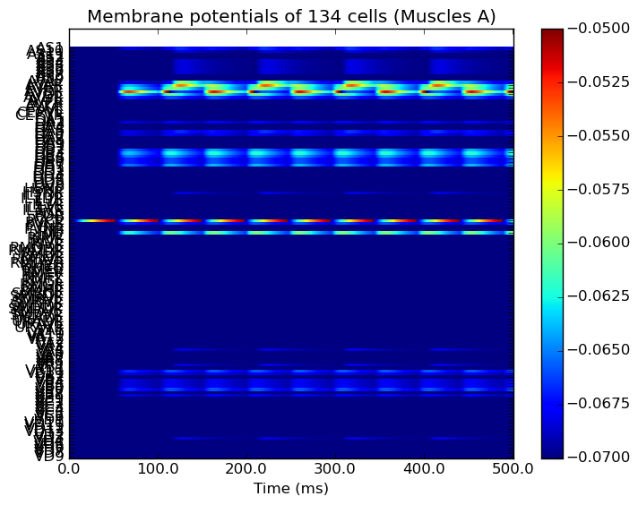</a> <a href="https://github.com/openworm/CElegansNeuroML/blob/master/CElegans/pythonScripts/c302/examples/c302_A_Muscles.nml"/>NML</a>&nbsp;<a href="http://opensourcebrain.org/projects/celegans?explorer=https://raw.githubusercontent.com/openworm/CElegansNeuroML/master/CElegans/pythonScripts/c302/examples/c302_A_Muscles.nml"/>OSB</a></td><td> <a href="https://github.com/openworm/CElegansNeuroML/blob/master/CElegans/pythonScripts/c302/examples/c302_A_Full.nml"/>NML</a>&nbsp;<a href="http://opensourcebrain.org/projects/celegans?explorer=https://raw.githubusercontent.com/openworm/CElegansNeuroML/master/CElegans/pythonScripts/c302/examples/c302_A_Full.nml"/>OSB</a></td></tr>
<tr><td><b><a href="https://github.com/openworm/CElegansNeuroML/blob/master/CElegans/pythonScripts/c302/parameters_B.py">Params B</a></b></td><td> <a href="https://github.com/openworm/CElegansNeuroML/blob/master/CElegans/pythonScripts/c302/examples/c302_B_IClamp.nml"/>NML</a>&nbsp;<a href="http://opensourcebrain.org/projects/celegans?explorer=https://raw.githubusercontent.com/openworm/CElegansNeuroML/master/CElegans/pythonScripts/c302/examples/c302_B_IClamp.nml"/>OSB</a></td><td> <a href="https://github.com/openworm/CElegansNeuroML/blob/master/CElegans/pythonScripts/c302/examples/c302_B_Syns.nml"/>NML</a>&nbsp;<a href="http://opensourcebrain.org/projects/celegans?explorer=https://raw.githubusercontent.com/openworm/CElegansNeuroML/master/CElegans/pythonScripts/c302/examples/c302_B_Syns.nml"/>OSB</a></td><td> <a href="https://github.com/openworm/CElegansNeuroML/blob/master/CElegans/pythonScripts/c302/examples/c302_B_Pharyngeal.nml"/>NML</a>&nbsp;<a href="http://opensourcebrain.org/projects/celegans?explorer=https://raw.githubusercontent.com/openworm/CElegansNeuroML/master/CElegans/pythonScripts/c302/examples/c302_B_Pharyngeal.nml"/>OSB</a></td><td> <a href="https://github.com/openworm/CElegansNeuroML/blob/master/CElegans/pythonScripts/c302/examples/c302_B_Social.nml"/>NML</a>&nbsp;<a href="http://opensourcebrain.org/projects/celegans?explorer=https://raw.githubusercontent.com/openworm/CElegansNeuroML/master/CElegans/pythonScripts/c302/examples/c302_B_Social.nml"/>OSB</a></td><td> <a href="https://github.com/openworm/CElegansNeuroML/blob/master/CElegans/pythonScripts/c302/examples/c302_B_Oscillator.nml"/>NML</a>&nbsp;<a href="http://opensourcebrain.org/projects/celegans?explorer=https://raw.githubusercontent.com/openworm/CElegansNeuroML/master/CElegans/pythonScripts/c302/examples/c302_B_Oscillator.nml"/>OSB</a></td><td><a href="summary_B_Muscles.md"/>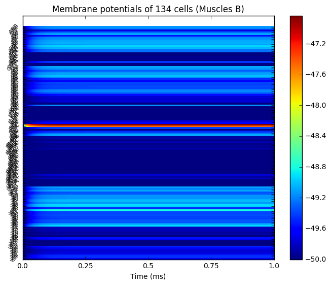</a> <a href="https://github.com/openworm/CElegansNeuroML/blob/master/CElegans/pythonScripts/c302/examples/c302_B_Muscles.nml"/>NML</a>&nbsp;<a href="http://opensourcebrain.org/projects/celegans?explorer=https://raw.githubusercontent.com/openworm/CElegansNeuroML/master/CElegans/pythonScripts/c302/examples/c302_B_Muscles.nml"/>OSB</a></td><td><a href="summary_B_Full.md"/>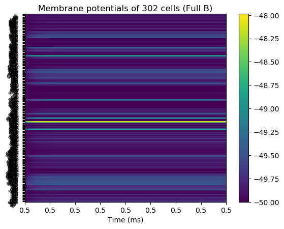</a> <a href="https://github.com/openworm/CElegansNeuroML/blob/master/CElegans/pythonScripts/c302/examples/c302_B_Full.nml"/>NML</a>&nbsp;<a href="http://opensourcebrain.org/projects/celegans?explorer=https://raw.githubusercontent.com/openworm/CElegansNeuroML/master/CElegans/pythonScripts/c302/examples/c302_B_Full.nml"/>OSB</a></td></tr>
<tr><td><b><a href="https://github.com/openworm/CElegansNeuroML/blob/master/CElegans/pythonScripts/c302/parameters_C.py">Params C</a></b></td><td> <a href="https://github.com/openworm/CElegansNeuroML/blob/master/CElegans/pythonScripts/c302/examples/c302_C_IClamp.nml"/>NML</a>&nbsp;<a href="http://opensourcebrain.org/projects/celegans?explorer=https://raw.githubusercontent.com/openworm/CElegansNeuroML/master/CElegans/pythonScripts/c302/examples/c302_C_IClamp.nml"/>OSB</a></td><td> <a href="https://github.com/openworm/CElegansNeuroML/blob/master/CElegans/pythonScripts/c302/examples/c302_C_Syns.nml"/>NML</a>&nbsp;<a href="http://opensourcebrain.org/projects/celegans?explorer=https://raw.githubusercontent.com/openworm/CElegansNeuroML/master/CElegans/pythonScripts/c302/examples/c302_C_Syns.nml"/>OSB</a></td><td> <a href="https://github.com/openworm/CElegansNeuroML/blob/master/CElegans/pythonScripts/c302/examples/c302_C_Pharyngeal.nml"/>NML</a>&nbsp;<a href="http://opensourcebrain.org/projects/celegans?explorer=https://raw.githubusercontent.com/openworm/CElegansNeuroML/master/CElegans/pythonScripts/c302/examples/c302_C_Pharyngeal.nml"/>OSB</a></td><td> <a href="https://github.com/openworm/CElegansNeuroML/blob/master/CElegans/pythonScripts/c302/examples/c302_C_Social.nml"/>NML</a>&nbsp;<a href="http://opensourcebrain.org/projects/celegans?explorer=https://raw.githubusercontent.com/openworm/CElegansNeuroML/master/CElegans/pythonScripts/c302/examples/c302_C_Social.nml"/>OSB</a></td><td> <a href="https://github.com/openworm/CElegansNeuroML/blob/master/CElegans/pythonScripts/c302/examples/c302_C_Oscillator.nml"/>NML</a>&nbsp;<a href="http://opensourcebrain.org/projects/celegans?explorer=https://raw.githubusercontent.com/openworm/CElegansNeuroML/master/CElegans/pythonScripts/c302/examples/c302_C_Oscillator.nml"/>OSB</a></td><td> <a href="https://github.com/openworm/CElegansNeuroML/blob/master/CElegans/pythonScripts/c302/examples/c302_C_Muscles.nml"/>NML</a>&nbsp;<a href="http://opensourcebrain.org/projects/celegans?explorer=https://raw.githubusercontent.com/openworm/CElegansNeuroML/master/CElegans/pythonScripts/c302/examples/c302_C_Muscles.nml"/>OSB</a></td><td> <a href="https://github.com/openworm/CElegansNeuroML/blob/master/CElegans/pythonScripts/c302/examples/c302_C_Full.nml"/>NML</a>&nbsp;<a href="http://opensourcebrain.org/projects/celegans?explorer=https://raw.githubusercontent.com/openworm/CElegansNeuroML/master/CElegans/pythonScripts/c302/examples/c302_C_Full.nml"/>OSB</a></td></tr>
<tr><td><b><a href="https://github.com/openworm/CElegansNeuroML/blob/master/CElegans/pythonScripts/c302/parameters_C1.py">Params C1</a></b></td><td> <a href="https://github.com/openworm/CElegansNeuroML/blob/master/CElegans/pythonScripts/c302/examples/c302_C1_IClamp.nml"/>NML</a>&nbsp;<a href="http://opensourcebrain.org/projects/celegans?explorer=https://raw.githubusercontent.com/openworm/CElegansNeuroML/master/CElegans/pythonScripts/c302/examples/c302_C1_IClamp.nml"/>OSB</a></td><td> <a href="https://github.com/openworm/CElegansNeuroML/blob/master/CElegans/pythonScripts/c302/examples/c302_C1_Syns.nml"/>NML</a>&nbsp;<a href="http://opensourcebrain.org/projects/celegans?explorer=https://raw.githubusercontent.com/openworm/CElegansNeuroML/master/CElegans/pythonScripts/c302/examples/c302_C1_Syns.nml"/>OSB</a></td><td> <a href="https://github.com/openworm/CElegansNeuroML/blob/master/CElegans/pythonScripts/c302/examples/c302_C1_Pharyngeal.nml"/>NML</a>&nbsp;<a href="http://opensourcebrain.org/projects/celegans?explorer=https://raw.githubusercontent.com/openworm/CElegansNeuroML/master/CElegans/pythonScripts/c302/examples/c302_C1_Pharyngeal.nml"/>OSB</a></td><td> <a href="https://github.com/openworm/CElegansNeuroML/blob/master/CElegans/pythonScripts/c302/examples/c302_C1_Social.nml"/>NML</a>&nbsp;<a href="http://opensourcebrain.org/projects/celegans?explorer=https://raw.githubusercontent.com/openworm/CElegansNeuroML/master/CElegans/pythonScripts/c302/examples/c302_C1_Social.nml"/>OSB</a></td><td> <a href="https://github.com/openworm/CElegansNeuroML/blob/master/CElegans/pythonScripts/c302/examples/c302_C1_Oscillator.nml"/>NML</a>&nbsp;<a href="http://opensourcebrain.org/projects/celegans?explorer=https://raw.githubusercontent.com/openworm/CElegansNeuroML/master/CElegans/pythonScripts/c302/examples/c302_C1_Oscillator.nml"/>OSB</a></td><td> <a href="https://github.com/openworm/CElegansNeuroML/blob/master/CElegans/pythonScripts/c302/examples/c302_C1_Muscles.nml"/>NML</a>&nbsp;<a href="http://opensourcebrain.org/projects/celegans?explorer=https://raw.githubusercontent.com/openworm/CElegansNeuroML/master/CElegans/pythonScripts/c302/examples/c302_C1_Muscles.nml"/>OSB</a></td><td><a href="summary_C1_Full.md"/>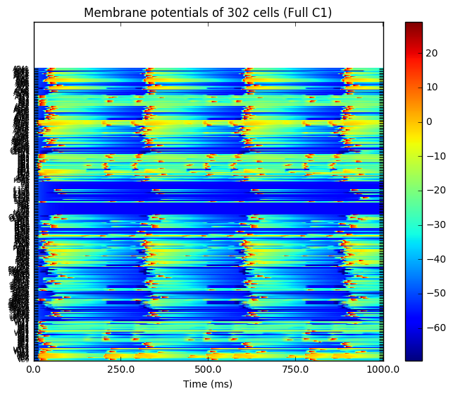</a> <a href="https://github.com/openworm/CElegansNeuroML/blob/master/CElegans/pythonScripts/c302/examples/c302_C1_Full.nml"/>NML</a>&nbsp;<a href="http://opensourcebrain.org/projects/celegans?explorer=https://raw.githubusercontent.com/openworm/CElegansNeuroML/master/CElegans/pythonScripts/c302/examples/c302_C1_Full.nml"/>OSB</a></td></tr>
<tr><td><b><a href="https://github.com/openworm/CElegansNeuroML/blob/master/CElegans/pythonScripts/c302/parameters_D.py">Params D</a></b></td><td><a href="summary_D_IClamp.md"/>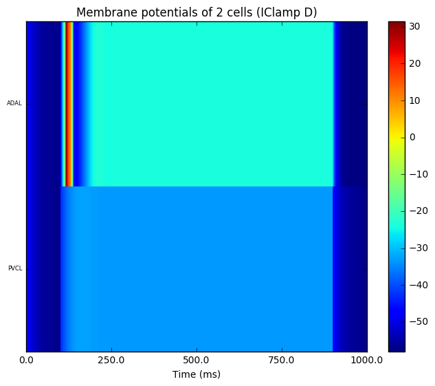</a> <a href="https://github.com/openworm/CElegansNeuroML/blob/master/CElegans/pythonScripts/c302/examples/c302_D_IClamp.nml"/>NML</a>&nbsp;<a href="http://opensourcebrain.org/projects/celegans?explorer=https://raw.githubusercontent.com/openworm/CElegansNeuroML/master/CElegans/pythonScripts/c302/examples/c302_D_IClamp.nml"/>OSB</a></td><td> <a href="https://github.com/openworm/CElegansNeuroML/blob/master/CElegans/pythonScripts/c302/examples/c302_D_Syns.nml"/>NML</a>&nbsp;<a href="http://opensourcebrain.org/projects/celegans?explorer=https://raw.githubusercontent.com/openworm/CElegansNeuroML/master/CElegans/pythonScripts/c302/examples/c302_D_Syns.nml"/>OSB</a></td><td> <a href="https://github.com/openworm/CElegansNeuroML/blob/master/CElegans/pythonScripts/c302/examples/c302_D_Pharyngeal.nml"/>NML</a>&nbsp;<a href="http://opensourcebrain.org/projects/celegans?explorer=https://raw.githubusercontent.com/openworm/CElegansNeuroML/master/CElegans/pythonScripts/c302/examples/c302_D_Pharyngeal.nml"/>OSB</a></td><td> <a href="https://github.com/openworm/CElegansNeuroML/blob/master/CElegans/pythonScripts/c302/examples/c302_D_Social.nml"/>NML</a>&nbsp;<a href="http://opensourcebrain.org/projects/celegans?explorer=https://raw.githubusercontent.com/openworm/CElegansNeuroML/master/CElegans/pythonScripts/c302/examples/c302_D_Social.nml"/>OSB</a></td><td><a href="summary_D_Oscillator.md"/>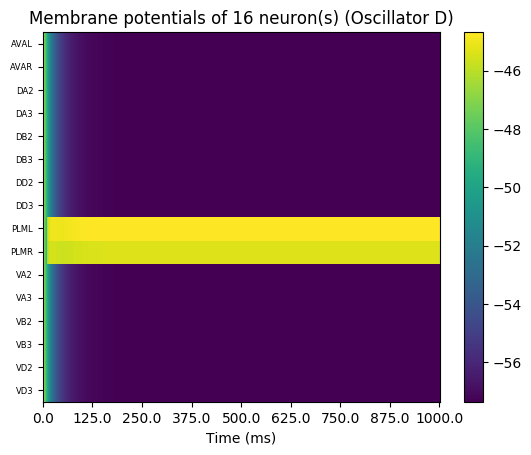</a> <a href="https://github.com/openworm/CElegansNeuroML/blob/master/CElegans/pythonScripts/c302/examples/c302_D_Oscillator.nml"/>NML</a>&nbsp;<a href="http://opensourcebrain.org/projects/celegans?explorer=https://raw.githubusercontent.com/openworm/CElegansNeuroML/master/CElegans/pythonScripts/c302/examples/c302_D_Oscillator.nml"/>OSB</a></td><td><a href="summary_D_Muscles.md"/>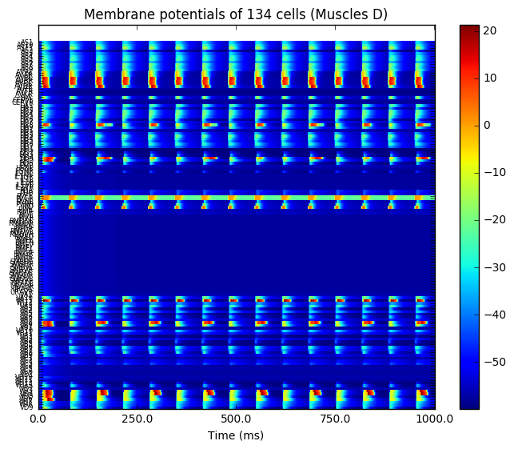</a> <a href="https://github.com/openworm/CElegansNeuroML/blob/master/CElegans/pythonScripts/c302/examples/c302_D_Muscles.nml"/>NML</a>&nbsp;<a href="http://opensourcebrain.org/projects/celegans?explorer=https://raw.githubusercontent.com/openworm/CElegansNeuroML/master/CElegans/pythonScripts/c302/examples/c302_D_Muscles.nml"/>OSB</a></td><td><a href="summary_D_Full.md"/>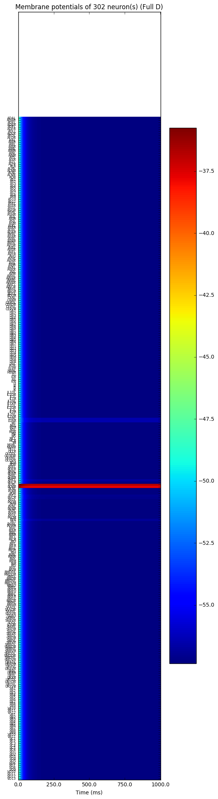</a> <a href="https://github.com/openworm/CElegansNeuroML/blob/master/CElegans/pythonScripts/c302/examples/c302_D_Full.nml"/>NML</a>&nbsp;<a href="http://opensourcebrain.org/projects/celegans?explorer=https://raw.githubusercontent.com/openworm/CElegansNeuroML/master/CElegans/pythonScripts/c302/examples/c302_D_Full.nml"/>OSB</a></td></tr>
<tr><td><b><a href="https://github.com/openworm/CElegansNeuroML/blob/master/CElegans/pythonScripts/c302/parameters_D1.py">Params D1</a></b></td><td> <a href="https://github.com/openworm/CElegansNeuroML/blob/master/CElegans/pythonScripts/c302/examples/c302_D1_IClamp.nml"/>NML</a>&nbsp;<a href="http://opensourcebrain.org/projects/celegans?explorer=https://raw.githubusercontent.com/openworm/CElegansNeuroML/master/CElegans/pythonScripts/c302/examples/c302_D1_IClamp.nml"/>OSB</a></td><td><a href="summary_D1_Syns.md"/>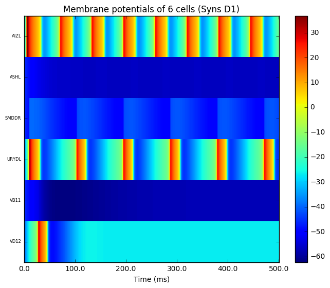</a> <a href="https://github.com/openworm/CElegansNeuroML/blob/master/CElegans/pythonScripts/c302/examples/c302_D1_Syns.nml"/>NML</a>&nbsp;<a href="http://opensourcebrain.org/projects/celegans?explorer=https://raw.githubusercontent.com/openworm/CElegansNeuroML/master/CElegans/pythonScripts/c302/examples/c302_D1_Syns.nml"/>OSB</a></td><td> <a href="https://github.com/openworm/CElegansNeuroML/blob/master/CElegans/pythonScripts/c302/examples/c302_D1_Pharyngeal.nml"/>NML</a>&nbsp;<a href="http://opensourcebrain.org/projects/celegans?explorer=https://raw.githubusercontent.com/openworm/CElegansNeuroML/master/CElegans/pythonScripts/c302/examples/c302_D1_Pharyngeal.nml"/>OSB</a></td><td><a href="summary_D1_Social.md"/>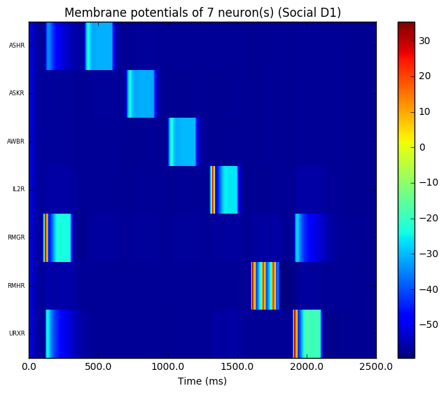</a> <a href="https://github.com/openworm/CElegansNeuroML/blob/master/CElegans/pythonScripts/c302/examples/c302_D1_Social.nml"/>NML</a>&nbsp;<a href="http://opensourcebrain.org/projects/celegans?explorer=https://raw.githubusercontent.com/openworm/CElegansNeuroML/master/CElegans/pythonScripts/c302/examples/c302_D1_Social.nml"/>OSB</a></td><td> <a href="https://github.com/openworm/CElegansNeuroML/blob/master/CElegans/pythonScripts/c302/examples/c302_D1_Oscillator.nml"/>NML</a>&nbsp;<a href="http://opensourcebrain.org/projects/celegans?explorer=https://raw.githubusercontent.com/openworm/CElegansNeuroML/master/CElegans/pythonScripts/c302/examples/c302_D1_Oscillator.nml"/>OSB</a></td><td><a href="summary_D1_Muscles.md"/>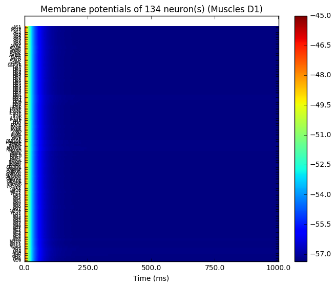</a> <a href="https://github.com/openworm/CElegansNeuroML/blob/master/CElegans/pythonScripts/c302/examples/c302_D1_Muscles.nml"/>NML</a>&nbsp;<a href="http://opensourcebrain.org/projects/celegans?explorer=https://raw.githubusercontent.com/openworm/CElegansNeuroML/master/CElegans/pythonScripts/c302/examples/c302_D1_Muscles.nml"/>OSB</a></td><td><a href="summary_D1_Full.md"/>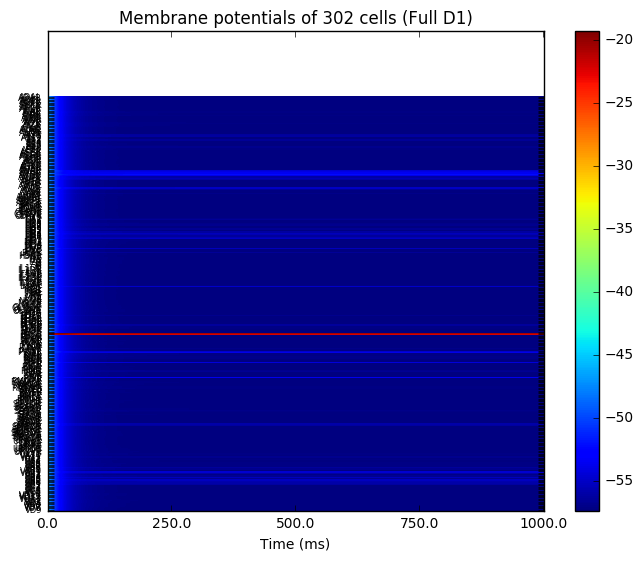</a> <a href="https://github.com/openworm/CElegansNeuroML/blob/master/CElegans/pythonScripts/c302/examples/c302_D1_Full.nml"/>NML</a>&nbsp;<a href="http://opensourcebrain.org/projects/celegans?explorer=https://raw.githubusercontent.com/openworm/CElegansNeuroML/master/CElegans/pythonScripts/c302/examples/c302_D1_Full.nml"/>OSB</a></td></tr>
</table>
