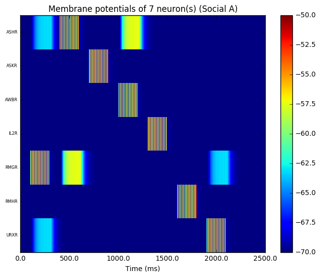
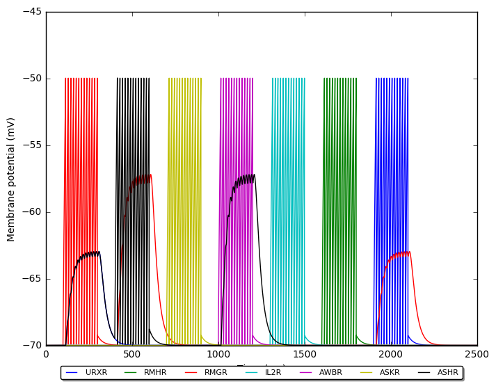

### Parameter config summary 
<table>

<tr>
  <td></td>
  <td></td>
</tr>

<tr>
  <td></td>
  <td></td>
</tr>

<tr>
  <td></td>
  <td></td>
</tr>

<tr>
  <td></td>
  <td></td>
</tr>
</table>
<table>

<tr><td></td>

  <td></td>

  <td></td></tr>

<tr><td></td>

  <td></td></tr>
</table>
